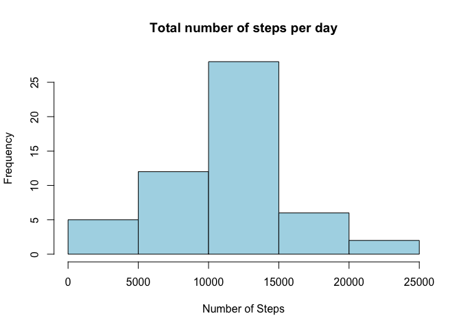

# Reproducible Research: Peer Assessment 1
Karen Rittenhouse Mitchell  
## Introduction

This analysis makes use of data from a personal activity monitoring device that collects data at 5-minute intervals through out the day. These type of devices are part of the “quantified self” movement – a group of enthusiasts who take measurements about themselves regularly to improve their health, to find patterns in their behavior, or because they are tech geeks. The dataset consists of two months of data from an anonymous individual collected during the months of October and November, 2012, and includes the number of steps taken in 5-minute intervals each day.

The variables included in this dataset are:

* steps: Number of steps taking in a 5-minute interval (missing values are coded as NA)

* date: The date on which the measurement was taken in YYYY-MM-DD format

* interval: Identifier for the 5-minute interval in which measurement was taken

The dataset is stored in a comma-separated-value (CSV) file and there are a total of 17,568 observations in this dataset.

## Loading and preprocessing the data

Data for this project were obtained online on 14-November-2015 from: https://d396qusza40orc.cloudfrom.net/repdata%2Fdata%2Factivity.zip
The downloaded file, named activity.csv, was moved into the working directory.

The data were loaded into R from the working directory using read.csv:


```r
activity <- read.csv("activity.csv")
```

No additional preprocessing was done prior to the output-specific code shown in the following sections.

## What is mean total number of steps taken per day?

To determine the mean total number of steps taken per day, I began by using the dplyr function group_by() to group the activity data by date.  I then summarized each date group by the total number of steps, and visualized the resultant totals in a histogram.


```r
library(dplyr)
```

```
## 
## Attaching package: 'dplyr'
## 
## The following objects are masked from 'package:stats':
## 
##     filter, lag
## 
## The following objects are masked from 'package:base':
## 
##     intersect, setdiff, setequal, union
```

```r
actbydate <- group_by(activity, date)
stepsbydate <- summarize(actbydate, totalsteps = sum(steps))
hist(stepsbydate$totalsteps, freq = TRUE, col = "light blue",
     main = "Total number of steps per day", 
     xlab = "Number of Steps")
```

 

The mean and median of the daily step totals were calculated as shown below.  It was necessary to specify na.rm = TRUE for R to be able to calculate the values.


```r
meanstepsbydate <- mean(stepsbydate$totalsteps, na.rm = TRUE)
print(meanstepsbydate)
```

```
## [1] 10766.19
```

```r
medianstepsbydate <- median(stepsbydate$totalsteps, na.rm = TRUE)
print(medianstepsbydate)
```

```
## [1] 10765
```


## What is the average daily activity pattern?

I visualized the average daily activity pattern by constructing a line plot of the daily average number of steps taken versus time (the 5-minute interval identifier). This required grouping the activity data by interval, and summarizing each group to get the mean number of steps for each interval.


```r
actbyint <- group_by(activity, interval)
stepsbyint <- summarize(actbyint, avgsteps = mean(steps, na.rm = TRUE))

plot(stepsbyint$interval, stepsbyint$avgsteps, type = "l",
     main = "Average number of steps by interval for all days", 
     xlab = "Interval", ylab = "Average number of steps", 
     lwd = 2, col = "red")
```

 

We can then use the max() function on the summarized data to identify the maximum average daily step count and, finally, filter the dataset by that value to identify the interval at which the maximum occurred - in this case, at interval 825, with an average step count of 206.2.


```r
maxavg <- max(stepsbyint$avgsteps)
print(filter(stepsbyint, stepsbyint$avgsteps == maxavg))
```

```
## Source: local data frame [1 x 2]
## 
##   interval avgsteps
## 1      835 206.1698
```

## Imputing missing values

There are 2304 days/intervals with missing step count values (coded as NA). The presence of missing days may introduce bias into some calculations or summaries of the data. 


```r
head(activity)
```

```
##   steps       date interval
## 1    NA 2012-10-01        0
## 2    NA 2012-10-01        5
## 3    NA 2012-10-01       10
## 4    NA 2012-10-01       15
## 5    NA 2012-10-01       20
## 6    NA 2012-10-01       25
```

```r
colSums(is.na(activity))
```

```
##    steps     date interval 
##     2304        0        0
```

I imputed values for these missing observations by replacing them with the mean for that 5-minute interval, obtained as part of the daily pattern analysis above, in an otherwise duplicative dataframe 'imputeact'.  


```r
imputeact <- activity
for(i in 1:nrow(activity)) {
     if(is.na(imputeact$steps[i])) {
          nainterval <- imputeact[i, 3]
          intmean <- filter(stepsbyint, interval == nainterval)
          imputeact$steps[i] <- as.numeric(intmean[, 2])
     }
}
head(imputeact)
```

```
##       steps       date interval
## 1 1.7169811 2012-10-01        0
## 2 0.3396226 2012-10-01        5
## 3 0.1320755 2012-10-01       10
## 4 0.1509434 2012-10-01       15
## 5 0.0754717 2012-10-01       20
## 6 2.0943396 2012-10-01       25
```

I then constructed a histogram of the total number of steps taken each day and calculated the mean and median total number of steps taken per day for the expanded dataset to compare it with the original as shown previously. 


```r
imputebydate <- group_by(imputeact, date)
imputestepsbydate <- summarize(imputebydate, totalsteps = sum(steps))
hist(imputestepsbydate$totalsteps, freq = TRUE, col = "light salmon",
     main = "Total number of steps per day", 
     sub = "assumes missing data = interval average", 
     xlab = "Number of Steps")
```

 

```r
imputemeanstepsbydate <- mean(imputestepsbydate$totalsteps)
print(imputemeanstepsbydate)
```

```
## [1] 10766.19
```

```r
imputemedianstepsbydate <- median(imputestepsbydate$totalsteps)
print(imputemedianstepsbydate)
```

```
## [1] 10766.19
```

The mean of the two datasets is identical, which seems logical given that the imputed data were sourced from mean values from the original dataset.  The median of the imputed data was slightly higher than the median of the original data, though very close, and identical to the mean of both data sets.  Again, this seems logical given that the imputed data were sourced from the original means.  The histogram shows that the imputed data possess a somewhat stronger central tendency (higher frequency of near-mean values).  Overall, adding the imputed data did little to alter the interpretation of this dataset, but may have strengthened that interpretation.

## Are there differences in activity patterns between weekdays and weekends?

To compare weekend and weekday activity patterns we must first create a factor variable in the dataset with two levels – “weekday” and “weekend” - indicating whether a given date is a weekday or weekend day. I used the weekdays() function for this. I was then able to group the data by this factor and the interval, and summarize each factor/interval pair to get the average steps in each.


```r
imputeact$weekday <- weekdays(as.POSIXlt(imputeact$date))   
imputeact$weekend = as.factor(ifelse(imputeact$weekday %in% c("Saturday", "Sunday"), 
                           "weekend", "weekday"))
imputeactbyint <- group_by(imputeact, interval, weekend)
imputestepsbyint <- summarize(imputeactbyint, avgsteps = mean(steps))

head(imputestepsbyint)
```

```
## Source: local data frame [6 x 3]
## Groups: interval
## 
##   interval weekend   avgsteps
## 1        0 weekday 2.25115304
## 2        0 weekend 0.21462264
## 3        5 weekday 0.44528302
## 4        5 weekend 0.04245283
## 5       10 weekday 0.17316562
## 6       10 weekend 0.01650943
```

We can then visualize the activity patterns for each factor ("weekday", "weekend") via a two-panel line plot of average steps by interval.


```r
library(ggplot2)
panels <- ggplot(imputestepsbyint, aes(interval, avgsteps))
panels + facet_grid(weekend ~ .) + geom_line(colour = "blue")
```

 

The two plots suggest that, while the most intense activity (highest steps per interval) occurred during weekdays, the subject appears to be more active overall on weekends.  Activity commences later on weekend days, but persists later as well and is generally of highter intensity.  

## Conclusions

While the analysis included in this report focuses on interpreting data from a personal activity monitoring device, the true goals of the report were demonstrating the utility of and author's facility in producing a literate statistical analysis.  This report succeeds in fulfilling those goals.  A more complete statistical analysis would likely include more rigorous statistical description of the data, hypothesis testing to assess the validity of the visual interpretations, and potentially more robust assessment of temporal trends (i.e., did activity intensity vary over the course of observation).  
